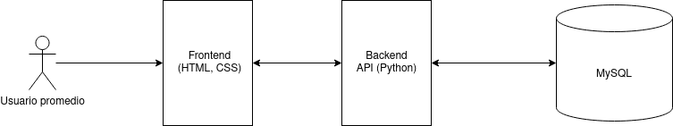

# Anteproyecto - Banana Shopping

## Índice

+ [Descripción del problema](#id1)
+ [Objetivo](#id2)
+ [Arquitectura y tecnologías usadas](#id3)
+ [Boceto de la solución](#id4)

### Descripción del problema 

  El proyecto que se propone surge de querer hacer una pagina web de compras online propia para la venta de componentes informáticos principalmente en Canarias debido a la que la mayoría de empresas no realizan envios a las islas y si se hacen, el tiempo de envio es notorio o los precios elevados debido a envios express. En dicha web los clientes tendrán la capacidad de obtener sus mercancias lo antes posible y a un precio adecuado de mercado.

### Objetivo. 
  El objetivo de la web es proveer a todas las personas que quieran adquirir componentes informáticos de diversas marcas y llegar a un mercado principalmente basado en Canarias debido a la lejania de grandes proveedores de productos.

### Arquitectura y tecnologías a utilizar. 
  La página web estará compuesta por un entorno de frontend compuesto por HTMl y CSS y un entorno de backend en Python. Se decidió usar estos lenguajes debido a los siguientes motivos:
  Se decidió usar Python debido a su amplia implementación por diversas empresas del sector.
  HTML es el esqueleto básico de cualquier página web, aunque se usará la versión más actual (HTML 5).

#### Boceto de la solución 

