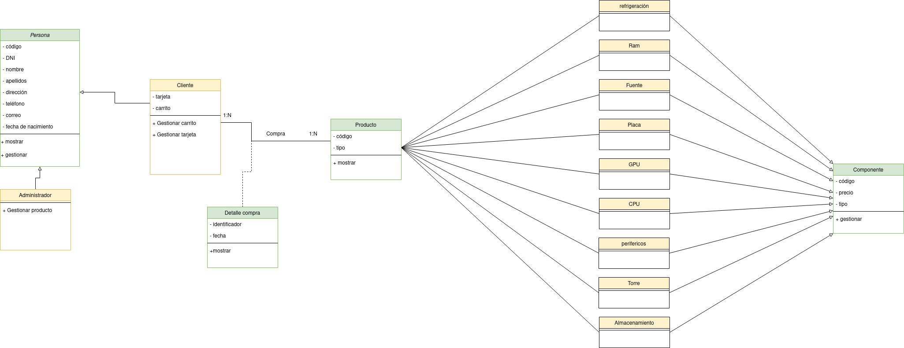

# Banana Shopping:

  

# Index

+ [Actores](#id1)
  + [Cliente no registrado](#id2)
  + [Cliente registrado](#id3)
  + [Administrador](#id4)
+ [Casos de uso](#id5)
  + [Casos de uso de clientes](#id6)
    + [Registrarse](#id7)
    + [Asociar tarjeta](#id8)
    + [Realizar pedido](#id9)
    + [Mostrar producto](#id10)
    + [Seleccionar producto](#id11)
    + [Comprar producto](#id12)
    + [Rechazar compra](#id13)
    + [Confirmar compra](#id14)
    + [Verificar saldo](#id15)
    + [Verificar stock](#id16)
  + [Casos de uso del administrador](#id17)
    + [Eliminar productos](#id18)
    + [Añadir productos](#id19)
    + [Modificar productos](#id20)
    + [Añadir usuarios](#id21)
    + [Eliminar usuarios](#id22)
    + [Modificar usuarios](#id23)
    + [Autenticarse](#id24)

Nuestro sistema se basa en una tienda de compras online, donde los clientes podrán pedir productos con envios casi inmediatos entre las Islas Canarias

## Actores 

### Cliente no registrado 

|  Actor | Cliente no registrado |
|---|---|
| Descripción  | Cliente que entra a la aplicación a ojear los productos y ofertas.  |
| Características  |  |
| Relaciones | No tiene relaciones con otros actores  |
| Referencias | CU1, CU2 |   
|  Notas |   |
| Autores  | __Marlon Farizo Hergueta y Ayoze Hernández Díaz__ |
|Fecha | _31/03/2023_ |

### Cliente registrado 

|  Actor | Cliente registrado |
|---|---|
| Descripción  | Cliente que ya está registrado en la aplicación  |
| Características  |  |
| Relaciones | cliente no registrado  |
| Referencias | CU3, CU4, CU5, CU6, CU7, CU8, CU9, CU10, CU17 |   
|  Notas |   |
| Autores  | __Marlon Farizo Hergueta y Ayoze Hernández Díaz__ |
|Fecha | _31/03/2023_ |

### Administrador 

|  Actor | Administrador |
|---|---|
| Descripción  | Administrador que se encarga de gestionar la aplicación  |
| Características  |  |
| Relaciones |   |
| Referencias | CU11, CU12, CU13, CU14, CU15, CU16, CU17 |   
|  Notas |   |
| Autores  | __Marlon Farizo Hergueta y Ayoze Hernández Díaz__ |
|Fecha | _31/03/2023_ |

## Casos de uso 

### Casos de uso de clientes 

#### Registrarse 

| CU1 | CU1 Registrarse |
|---|---|
| Fuentes  | [Este documento](diagrama_cu.md)  |
| Actor  | Cliente registrado, cliente no registrado  |
| Descripción |  Método que permite a un cliente registrarse en el sistema |
| Flujo básico | El cliente entra al sistema y se registra |
| Pre-condiciones |  |  
| Post-condiciones  |   |  
|  Requerimientos |   |
|  Notas |   |
| Autores  | __Marlon Farizo Hergueta y Ayoze Hernández Díaz__ |
|Fecha | _31/03/2023_ |

#### Asociar tarjeta 

| CU2 | CU2 Asociar tarjeta|
|---|---|
| Fuentes  | [Este documento](diagrama_cu.md)  |
| Actor  | Cliente registrado, cliente no registrado  |
| Descripción | Método que permite a un cliente asociar una tarjeta al registrarse  |
| Flujo básico | El cliente al registrarse asocia la tarjeta |
| Pre-condiciones |  |  
| Post-condiciones  |   |  
|  Requerimientos |   |
|  Notas |   |
| Autores  | __Marlon Farizo Hergueta y Ayoze Hernández Díaz__ |
|Fecha | _31/03/2023_ |

#### Realizar Pedido 

| CU3 | CU3 Realizar Pedido |
|---|---|
| Fuentes  | [Este documento](diagrama_cu.md) |
| Actor  |  Cliente registrado |
| Descripción |  Método que permite al cliente elegir un producto para comprarlo |
| Flujo básico | El cliente realiza un pedido |
| Pre-condiciones |  |  
| Post-condiciones  | |  
| Requerimientos |   |
| Notas |   |
| Autores  | __Marlon Farizo Hergueta y Ayoze Hernández Díaz__ |
|Fecha | _31/03/2023_ |

#### Mostrar producto 

| CU4 | CU4 Mostrar producto |
|---|---|
| Fuentes  | [Este documento](diagrama_cu.md)  |
| Actor  |  Cliente registrado |
| Descripción |  Método que permite mostrar los productos |
| Flujo básico | El cliente realiza un pedido y se autentica |
| Pre-condiciones | Interactuar con el CU3 |  
| Post-condiciones  |   |  
|  Requerimientos | Estar autenticado  |
|  Notas |   |
| Autores  | __Marlon Farizo Hergueta y Ayoze Hernández Díaz__ |
|Fecha | _31/03/2023_ |

#### Seleccionar producto 

| CU5 | CU5 Seleccionar producto |
|---|---|
| Fuentes  | [Este documento](diagrama_cu.md)  |
| Actor  | Cliente registrado  |
| Descripción | Método que permite seleccionar productos para comprar   |
| Flujo básico | El cliente realiza un pedido y selecciona los productos que quiere |
| Pre-condiciones | Interactuar con el CU3 |  
| Post-condiciones  |   |  
|  Requerimientos | Estar autenticado  |
|  Notas |   |
| Autores  | __Marlon Farizo Hergueta y Ayoze Hernández Díaz__ |
|Fecha | _31/03/2023_ |

#### Comprar producto 

| CU6 | CU6 Comprar producto |
|---|---|
| Fuentes  | [Este documento](diagrama_cu.md)  |
| Actor  | Cliente registrado  |
| Descripción |  Método que permite comprar los productos |
| Flujo básico | El cliente realiza un pedido, selecciona un producto y decide comprarlo |
| Pre-condiciones | Interactuar con el CU3 |  
| Post-condiciones  |   |  
|  Requerimientos | Estar autenticado  |
|  Notas |   |
| Autores  | __Marlon Farizo Hergueta y Ayoze Hernández Díaz__ |
|Fecha | _31/03/2023_ |

#### Rechazar compra 

| CU7 | CU7 Rechazar compra |
|---|---|
| Fuentes  | [Este documento](diagrama_cu.md)  |
| Actor  | Cliente registrado  |
| Descripción |  Método que permite denegar una compra debido a saldo insuficiente |
| Flujo básico | El cliente realiza una compra, y esta es denegada |
| Pre-condiciones | Interactuar con el CU3 |  
| Post-condiciones  |   |  
| Requerimientos | Estar autenticado |
| Notas |   |
| Autores  | __Marlon Farizo Hergueta y Ayoze Hernández Díaz__ |
|Fecha | _31/03/2023_ |

#### Confirmar compra 

| CU8 | CU8 Confirmar compra |
|---|---|
| Fuentes  | [Este documento](diagrama_cu.md)  |
| Actor  | Cliente registrado  |
| Descripción |  Método que permite aceptar una compra |
| Flujo básico | El cliente realiza una compra, y esta es aceptada |
| Pre-condiciones |  |  
| Post-condiciones  |   |  
|  Requerimientos | Estar autenticado |
|  Notas |   |
| Autores  | __Marlon Farizo Hergueta y Ayoze Hernández Díaz__ |
|Fecha | _31/03/2023_ |

#### Verificar saldo 

| CU9 | CU9 Verificar saldo |
|---|---|
| Fuentes  | [Este documento](diagrama_cu.md)  |
| Actor  | Cliente registrado  |
| Descripción | Método que permite verificar el saldo de una cuenta |
| Flujo básico | El cliente realiza un pedido, se autentica y se verifica el saldo de la cuenta al comprar |
| Pre-condiciones |  |  
| Post-condiciones  |   | 
|  Requerimientos | Estar autenticado |
|  Notas |   |
| Autores  | __Marlon Farizo Hergueta y Ayoze Hernández Díaz__ |
|Fecha | _31/03/2023_ |

#### Verificar stock 

| CU10 | CU10 Verificar stock |
|---|---|
| Fuentes  | [Este documento](diagrama_cu.md)  |
| Actor  | Cliente registrado  |
| Descripción | Método que permite verificar el stock  |
| Flujo básico | El cliente realiza un pedido, se autentica y se verifica el stock de los productos  |
| Pre-condiciones |  |  
| Post-condiciones  |   |  
|  Requerimientos |   |
|  Notas |   |
| Autores  | __Marlon Farizo Hergueta y Ayoze Hernández Díaz__ |
|Fecha | _31/03/2023_ |

## Casos del administrador 

#### Eliminar productos 

| CU11 | CU11 Eliminar productos |
|---|---|
| Fuentes  | [Este documento](diagrama_cu.md)  |
| Actor  | Administrador  |
| Descripción | Método que permite eliminar productos |
| Flujo básico | El administrador se autentica y realiza esta acción |
| Pre-condiciones |  |  
| Post-condiciones  |   |  
|  Requerimientos | Haber realizado una autenticación  |
|  Notas |   |
| Autores  | __Marlon Farizo Hergueta y Ayoze Hernández Díaz__ |
|Fecha | _31/03/2023_ |

#### Añadir productos 

| CU12 | CU12 Añadir productos |
|---|---|
| Fuentes  | [Este documento](diagrama_cu.md)  |
| Actor  | Administrador  |
| Descripción | Método que permite añadir productos |
| Flujo básico | El administrador se autentica y realiza esta acción |
| Pre-condiciones |  |  
| Post-condiciones  |   |  
|  Requerimientos | Haber realizado una autenticación  |
|  Notas |   |
| Autores  | __Marlon Farizo Hergueta y Ayoze Hernández Díaz__ |
|Fecha | _31/03/2023_ |

#### Modificar productos 

| CU13 | CU13 Modificar productos |
|---|---|
| Fuentes  | [Este documento](diagrama_cu.md)  |
| Actor  |  Administrador |
| Descripción |  Método que permite añadirMétodo que permite modificar productos |
| Flujo básico | El administrador se autentica y realiza esta acción |
| Pre-condiciones |  |  
| Post-condiciones  |   |  
|  Requerimientos | Haber realizado una autenticación  |
|  Notas |   |
| Autores  | __Marlon Farizo Hergueta y Ayoze Hernández Díaz__ |
|Fecha | _31/03/2023_ |

#### Añadir usuarios 

| CU14 | CU14 Añadir usuarios |
|---|---|
| Fuentes  | [Este documento](diagrama_cu.md)  |
| Actor  |  Administrador |
| Descripción |  Método que permite añadir usuarios |
| Flujo básico | El administrador se autentica y realiza esta acción |
| Pre-condiciones |  |  
| Post-condiciones  |   |  
|  Requerimientos | Haber realizado una autenticación  |
|  Notas |   |
| Autores  | __Marlon Farizo Hergueta y Ayoze Hernández Díaz__ |
|Fecha | _31/03/2023_ |

#### Eliminar usuarios 

| CU15 | CU15 Eliminar usuarios |
|---|---|
| Fuentes  | [Este documento](diagrama_cu.md)  |
| Actor  | Administrador  |
| Descripción | Método que permite eliminar usuarios  |
| Flujo básico | El administrador se autentica y realiza esta acción |
| Pre-condiciones |  |  
| Post-condiciones  |   |  
|  Requerimientos |  Haber realizado una autenticación |
|  Notas |   |
| Autores  | __Marlon Farizo Hergueta y Ayoze Hernández Díaz__ |
|Fecha | _31/03/2023_ |

#### Modificar usuarios 

| CU16 | CU16 Modificar usuarios |
|---|---|
| Fuentes  | [Este documento](diagrama_cu.md)  |
| Actor  |  Administrador |
| Descripción |  Método que permite modificar usuarios |
| Flujo básico | El administrador se autentica y realiza esta acción |
| Pre-condiciones |  |  
| Post-condiciones  |   |
|  Requerimientos |  Haber realizado una autenticación |
|  Notas |   |
| Autores  | __Marlon Farizo Hergueta y Ayoze Hernández Díaz__ |
|Fecha | _31/03/2023_ |

#### Autenticarse 

| CU17 | CU17 Autenticarse |
|---|---|
| Fuentes  | [[Este documento](diagrama_cu.md)](diagrama_cu.md)  |
| Actores  | Cliente registrado y administrador  |
| Descripción |   |
| Flujo básico | En el caso del administrador al entrar te autenticas,  el en caso del cliente al realizar un pedido te autenticas |
| Pre-condiciones |  |
| Post-condiciones  |   |  
|  Requerimientos | Estar registrado en el sistema |
|  Notas |   |
| Autores  | __Marlon Farizo Hergueta y Ayoze Hernández Díaz__ |
|Fecha | _31/03/2023_ |

